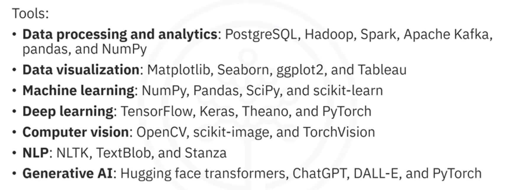

# Machine Learning with Python

## Tools for ML

Python libraries commonly used in machine learning include NumPy for numerical computations, Pandas for data analysis and preparation, SciPy for scientific computing, and Scikit-learn for building traditional machine learning models.

